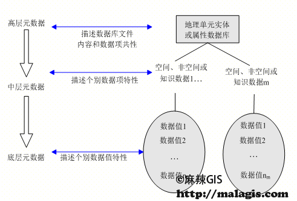

+++
title = "从元数据到地理语义"
date = "2017-06-12"
categories = ["学术思考"]
tags = ['GIS']
authors = ['forget']
slug = 'metadata2ontology'
+++

# 1. 元数据
## 1.1. 元数据的定义
> 元资料（Metadata），又称元数据、诠释资料、中介资料、中继资料、后设资料等，为描述其他资料资讯的资料。有三种不同类型的元资料，分别是记叙性元资料、结构性元资料和管理性元资料。

## 1.2. 地理信息元数据
在地理空间数据中，元数据是说明数据内容、质量、状况和其他有关特征的背景信息。

## 1.3. 地理信息元数据存储

一般数据集，复杂的可能是多个空间数据库和一般数据集的集合。因此，描述简单的数据集可以以文件的形式，但是复杂的大型数据库则需要建立元数据库。元数据描述的最基本数据组织形式是数据集，也可以扩展到数据集系列和数据集内的要素和属性。数据集有一般数据集和空间数据集两种。一般数据集结构比较简单，分为文本文件或二维表，元数据可以描述到文件、数据集系列、数据集或数据项；空间数据集相对比较复杂，一般既有记录空间定位信息的数据文件，又有与该文件连接的属性文件，空间信息之间可能还有拓扑关系。总之，元数据内容繁多，涉及数据集系列、数据集、要素或属性多种类型。此外网络系统中的数据库有简也有繁，简单的可能是一个。

在地球物理航次数据管理中，对于空间数据、属性数据和知识可以按系统的要求规定适当的层次，如高层元数据可对航次，中层元数据可对应表，底层元数据可对应数据项。

